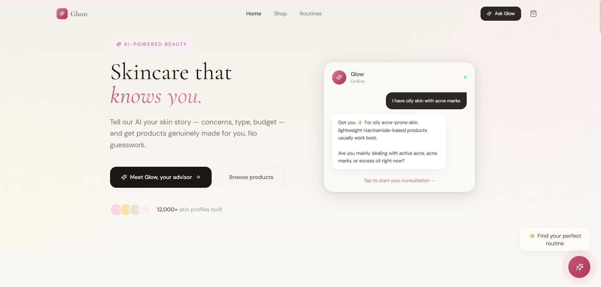
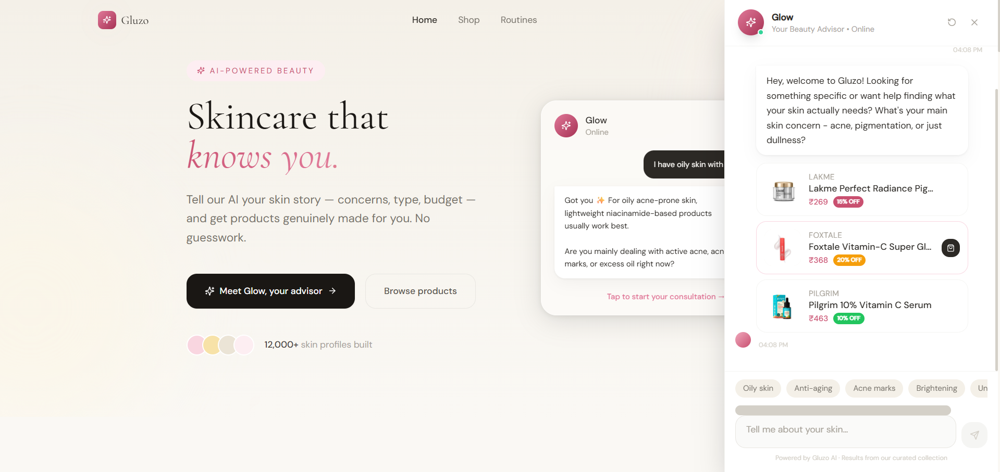
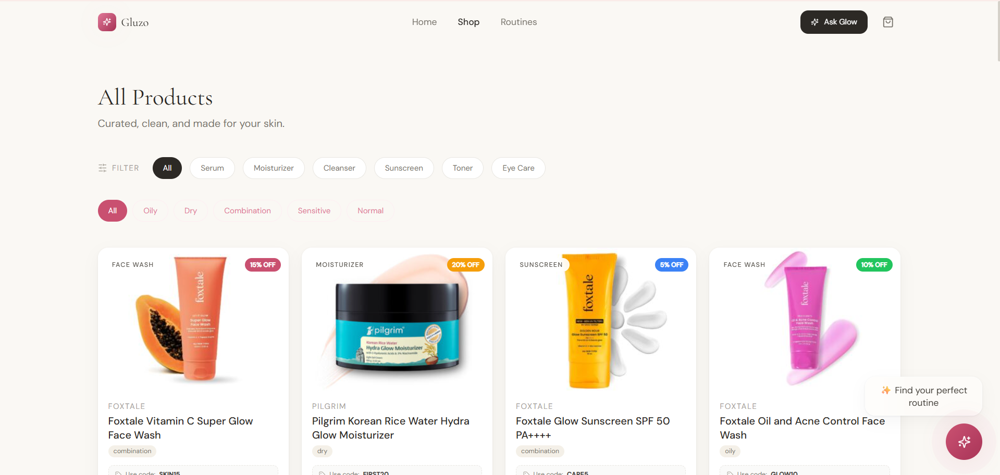
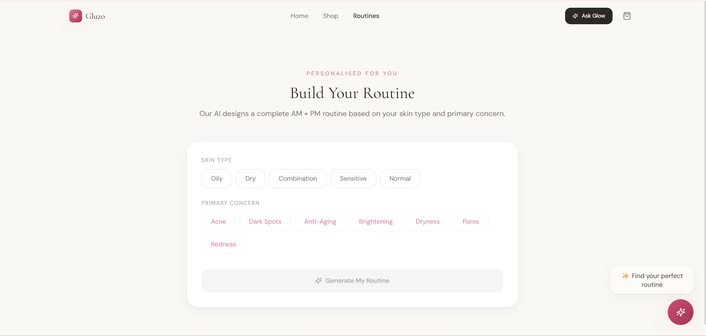

# 🌸 Gluzo AI — Smart Beauty Advisor

AI-powered skincare chatbot that recommends products based on your skin type, concerns & budget.

## 📸 Preview

### Home Page


### AI Chat


### Shop Page


### Routine Page


---

## 🚀 Getting Started (Clone & Run)

### Step 1 — Install Required Tools
- VS Code → [code.visualstudio.com](https://code.visualstudio.com)
- Python 3.10+ → [python.org](https://python.org)
- Node.js 18+ → [nodejs.org](https://nodejs.org)
- Git → [git-scm.com](https://git-scm.com)

### Step 2 — Clone the Project

Open terminal and run:
```bash
git clone https://github.com/AshishChaubey2003/gluzo-ai.git
cd gluzo-ai
code .
```

### Step 3 — Open Terminal in VS Code
Go to **Terminal** menu → **New Terminal**

Now follow the setup steps below 👇

---

## 🔑 Get Groq API Key (Free — Required)

1. Go to [groq.com](https://groq.com)
2. Click **Sign Up** (free)
3. Go to **API Keys** in left menu
4. Click **Create API Key**
5. Copy the key — starts with `gsk_...`

---

## 🖥️ Windows Setup

### Backend
Open terminal in the `Backend` folder — run one by one:

```bash
python -m venv venv
venv\Scripts\activate
pip install -r requirements.txt
pip install sentence-transformers
copy .env.example .env
```

Open `.env` file and update:
LLM_PROVIDER=groq
LLM_MODEL=llama-3.3-70b-versatile
GROQ_API_KEY=paste_your_groq_key_here

Start backend:
```bash
uvicorn app.main:app --reload --port 8000
```
✅ You should see: `Application startup complete`

### Frontend
Open a **new terminal** in the `frontend` folder:

```bash
npm install
copy .env.example .env.local
npm run dev
```
✅ Open [http://localhost:3000](http://localhost:3000)

---

## 🍎 Mac Setup

### Backend
Open terminal in the `Backend` folder — run one by one:

```bash
python3 -m venv venv
source venv/bin/activate
pip install -r requirements.txt
pip install sentence-transformers
cp .env.example .env
```

Open `.env` file and update:
LLM_PROVIDER=groq
LLM_MODEL=llama-3.3-70b-versatile
GROQ_API_KEY=paste_your_groq_key_here

Start backend:
```bash
uvicorn app.main:app --reload --port 8000
```
✅ You should see: `Application startup complete`

### Frontend
Open a **new terminal** in the `frontend` folder:

```bash
npm install
cp .env.example .env.local
npm run dev
```
✅ Open [http://localhost:3000](http://localhost:3000)

---

## ❓ Common Issues

**Backend not starting?**
- Make sure `(venv)` is showing in terminal
- Check Groq key is correctly added in `.env`
- Run: `pip install sentence-transformers`

**Products not loading?**
- Make sure backend is running on port 8000
- Check `frontend/.env.local` has:
  `VITE_API_URL=http://localhost:8000/api/v1`

**Chat not working?**
- Restart backend after any `.env` changes
- Check terminal for error messages

---

## 🛠️ Tech Stack

| Layer | Technology |
|-------|-----------|
| Frontend | React + TypeScript + Tailwind CSS |
| Backend | FastAPI + Python |
| AI/LLM | Groq (llama-3.3-70b) — Free & Fast |
| Search | FAISS + Sentence Transformers |
| State | Zustand |
| Animations | Framer Motion |

---
